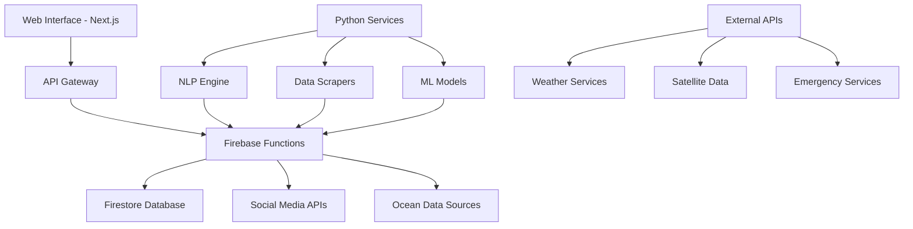

# 🌊 CORSAIR - Ocean Hazard Detection & Management System

**Smart Innovation in Healthcare (SIH) 2024 Project**  
*Advanced Real-time Ocean Safety Monitoring & Emergency Response Platform*

[](https://opensource.org/licenses/MIT)
[](https://nextjs.org/)
[](https://firebase.google.com/)
[](https://python.org/)

## 📋 Table of Contents
- [Overview](#-overview)
- [Features](#-features)
- [System Architecture](#-system-architecture)
- [Prerequisites](#-prerequisites)
- [Installation](#-installation)
- [Configuration](#-configuration)
- [Usage](#-usage)
- [API Documentation](#-api-documentation)
- [Contributing](#-contributing)
- [License](#-license)

## 🌟 Overview

CORSAIR (Comprehensive Ocean Risk and Safety Alert Information Relay) is an intelligent ocean hazard detection and management system designed to protect coastal communities and marine activities. The platform integrates real-time data analysis, social media monitoring, and AI-powered risk assessment to provide early warnings for ocean-related hazards.

### 🎯 Project Goals
- **Early Warning System**: Detect ocean hazards before they become critical
- **Community Safety**: Protect coastal populations and marine workers
- **Data-Driven Decisions**: Provide authorities with actionable intelligence
- **Multi-Source Integration**: Combine satellite data, social media, and IoT sensors
- **Real-time Response**: Enable rapid emergency response coordination

## ✨ Features

### 🔍 Core Detection Capabilities
- **Real-time Ocean Monitoring**: Continuous surveillance of ocean conditions
- **Social Media Intelligence**: Advanced NLP for hazard detection from social platforms
- **Multi-hazard Support**: Tsunamis, storms, oil spills, marine accidents
- **Predictive Analytics**: AI-powered risk assessment and forecasting
- **Emergency Alerting**: Automated notification system for critical events

### 🎨 User Interface
- **Interactive Maps**: Real-time visualization of ocean conditions and hazards
- **Dashboard Analytics**: Comprehensive reporting and trend analysis
- **Mobile Responsive**: Optimized for all devices and screen sizes
- **Multi-language Support**: Internationalization for global deployment
- **Accessibility**: WCAG 2.1 compliant interface design

### 🔧 Technical Features
- **Real-time Data Processing**: WebSocket-based live updates
- **Cloud-Native Architecture**: Scalable Firebase integration
- **API-First Design**: RESTful APIs for third-party integration
- **Advanced NLP**: Natural language processing for text analysis
- **Machine Learning**: Predictive models for risk assessment
- **Interactive Chatbot**: AI-powered citizen reporting and query system

## 🏗️ System Architecture



### Technology Stack
- **Frontend**: Next.js 14, React 18, TypeScript, Tailwind CSS
- **Backend**: Firebase Functions, Node.js, Python
- **Database**: Firestore, Real-time Database
- **AI/ML**: Google Cloud AI, Custom NLP models
- **Analytics**: Firebase Analytics, Custom dashboards
- **Deployment**: Firebase Hosting, Google Cloud Platform

## 📋 Prerequisites

### System Requirements
- **Node.js**: Version 18.0 or higher
- **Python**: Version 3.8 or higher
- **Git**: Latest version
- **Firebase CLI**: Latest version
- **Google Cloud SDK**: For advanced features

### Development Environment
- **Operating System**: Windows 10/11, macOS, or Linux
- **Memory**: Minimum 8GB RAM (16GB recommended)
- **Storage**: At least 2GB free space
- **Network**: Stable internet connection for real-time features

## 🚀 Installation

### 1. Clone the Repository
```bash
git clone https://github.com/Pranvkumar/SIH-PROJECT.git
cd SIH-PROJECT
```

### 2. Install Node.js Dependencies
```bash
npm install
# or
yarn install
```

### 3. Set Up Python Environment
```bash
cd python-services
pip install -r requirements.txt

# For free monitoring features
pip install -r requirements-free.txt
```

### 4. Install Firebase CLI
```bash
npm install -g firebase-tools
firebase login
```

### 5. Initialize Firebase Project
```bash
firebase init
# Select: Functions, Firestore, Hosting, Storage
```

## ⚙️ Configuration

### 1. Environment Variables
Create `.env.local` in the root directory:
```env
# Firebase Configuration
NEXT_PUBLIC_FIREBASE_API_KEY=your_api_key
NEXT_PUBLIC_FIREBASE_AUTH_DOMAIN=your_project.firebaseapp.com
NEXT_PUBLIC_FIREBASE_PROJECT_ID=your_project_id
NEXT_PUBLIC_FIREBASE_STORAGE_BUCKET=your_project.appspot.com
NEXT_PUBLIC_FIREBASE_MESSAGING_SENDER_ID=your_sender_id
NEXT_PUBLIC_FIREBASE_APP_ID=your_app_id

# Google Cloud Configuration
GOOGLE_CLOUD_PROJECT_ID=your_gcp_project
GOOGLE_APPLICATION_CREDENTIALS=path/to/service-account.json

# External APIs
WEATHER_API_KEY=your_weather_api_key
SOCIAL_MEDIA_API_KEYS=your_social_apis
```

### 2. Firebase Configuration
Update `firebase.json` with your project settings:
```json
{
  "hosting": {
    "public": "out",
    "ignore": ["firebase.json", "**/.*", "**/node_modules/**"]
  },
  "firestore": {
    "rules": "firestore.rules",
    "indexes": "firestore.indexes.json"
  }
}
```

### 3. Python Services Configuration
Configure Python services in `python-services/`:
- Update API endpoints in configuration files
- Set up social media monitoring credentials
- Configure NLP models and data sources

## 🖥️ Usage

### Development Mode
```bash
# Start the development server
npm run dev

# Access the chatbot interface
# Navigate to http://localhost:3000/chatbot

# Start Python services (separate terminal)
cd python-services
python social_media_monitor.py

# Start Genkit AI services (separate terminal)
npm run genkit:dev
```

### Production Build
```bash
# Build the application
npm run build

# Start production server
npm start

# Deploy to Firebase
firebase deploy
```

### Quick Setup Scripts
We've provided automated setup scripts for different environments:

**Windows:**
```batch
# Social media monitoring
scripts/setup-free-monitoring.bat

# Advanced NLP features
scripts/setup-advanced-nlp.bat

# Python services
scripts/setup-python-services.bat
```

**Linux/macOS:**
```bash
# Social media monitoring
./scripts/setup-free-monitoring.sh

# Advanced NLP features
./scripts/setup-advanced-nlp.sh

# Python services
./scripts/setup-python-services.sh
```

## 📚 API Documentation

### Core Endpoints

#### Citizen Reporting Chatbot
```bash
GET /api/chatbot/status
POST /api/chatbot/report
GET /api/chatbot/history
```

#### Ocean Data API
```bash
GET /api/ocean-data
POST /api/ocean-data/analyze
GET /api/ocean-data/hazards
```

#### Social Media Monitoring
```bash
GET /api/social-media/data
POST /api/social-media/monitor
GET /api/social-media/test-data
```

#### Emergency Alerts
```bash
POST /api/emergency/alert
GET /api/emergency/status
PUT /api/emergency/update
```

#### Weather Integration
```bash
GET /api/weather-data
GET /api/weather-data/forecast
POST /api/weather-data/alert
```

### Authentication
The API uses Firebase Authentication. Include the Authorization header:
```bash
Authorization: Bearer <firebase_id_token>
```

## 🧪 Testing

### Run Test Suite
```bash
# Frontend tests
npm test

# Python service tests
cd python-services
python -m pytest

# Integration tests
npm run test:integration
```

### Test Data Generation
```bash
# Generate sample reports
node create-sample-reports.js

# Test emergency alerts
node test-emergency-alert.js

# Test scraper integration
python test-scraper-integration.py
```

## 🐛 Debugging

### Debug Firebase Connection
```bash
node debug-firebase.js
node debug-firebase-permissions.js
```

### Debug Python Services
```bash
cd python-services
python -m pdb social_media_monitor.py
```

### Enable Debug Logging
Set environment variable:
```bash
DEBUG=corsair:*
```

## 📦 Deployment

### Firebase Deployment
```bash
# Deploy all services
firebase deploy

# Deploy specific services
firebase deploy --only hosting
firebase deploy --only functions
firebase deploy --only firestore
```

### Google Cloud Platform
```bash
# Deploy Python services to Cloud Run
gcloud run deploy corsair-python --source=./python-services

# Deploy with Docker
docker build -t corsair-app .
gcloud run deploy corsair-app --image gcr.io/PROJECT-ID/corsair-app
```

## 🤝 Contributing

We welcome contributions! Please see our [Contributing Guidelines](CONTRIBUTING.md) for details.

### Development Workflow
1. Fork the repository
2. Create a feature branch: `git checkout -b feature/amazing-feature`
3. Make your changes and test thoroughly
4. Commit: `git commit -m 'Add amazing feature'`
5. Push: `git push origin feature/amazing-feature`
6. Submit a Pull Request

### Code Standards
- Follow TypeScript/JavaScript best practices
- Use Prettier for code formatting
- Write comprehensive tests
- Document all public APIs
- Follow semantic versioning

## 📄 License

This project is licensed under the MIT License - see the [LICENSE](LICENSE) file for details.

## 🆘 Support

### Getting Help
- **Documentation**: Check our [Wiki](https://github.com/Pranvkumar/SIH-PROJECT/wiki)
- **Issues**: Report bugs via [GitHub Issues](https://github.com/Pranvkumar/SIH-PROJECT/issues)
- **Discussions**: Join our [GitHub Discussions](https://github.com/Pranvkumar/SIH-PROJECT/discussions)

### Contact Information
- **Project Lead**: Pranvkumar Kshirsagar
- **Email**: [Add your email]
- **GitHub**: [@Pranvkumar](https://github.com/Pranvkumar)

## 🏆 Acknowledgments

- **SIH 2024**: Smart India Hackathon organizing committee
- **Open Source Community**: Contributors and maintainers
- **Firebase Team**: For excellent cloud infrastructure
- **Next.js Team**: For the amazing React framework

---

**Made with ❤️ for Smart India Hackathon 2024**

*Building safer oceans through technology innovation*
